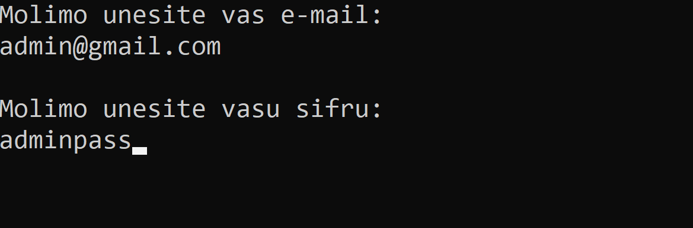
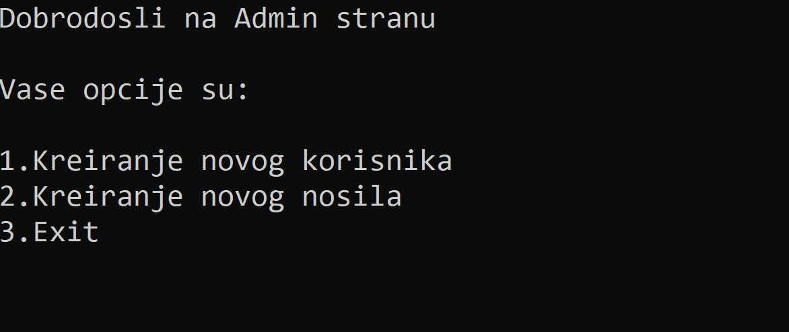
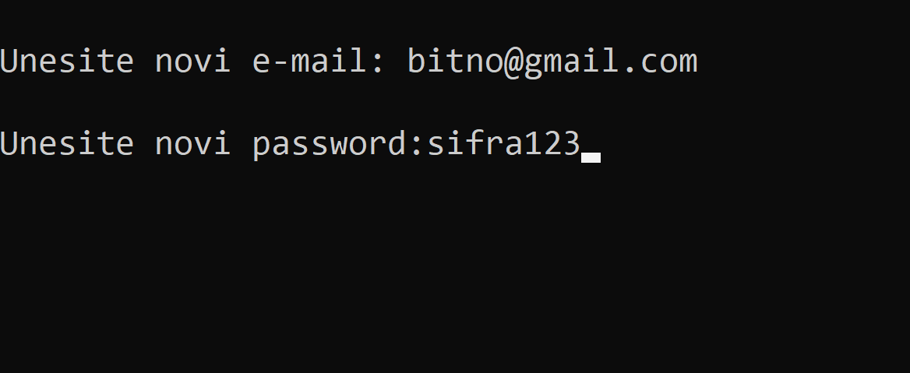
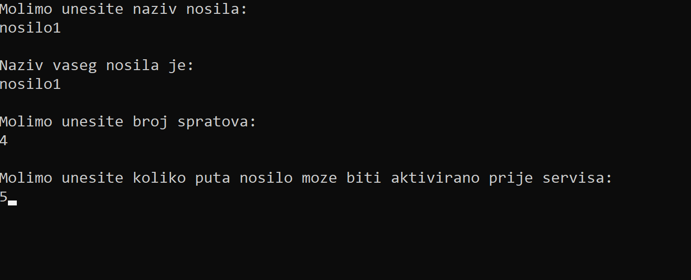
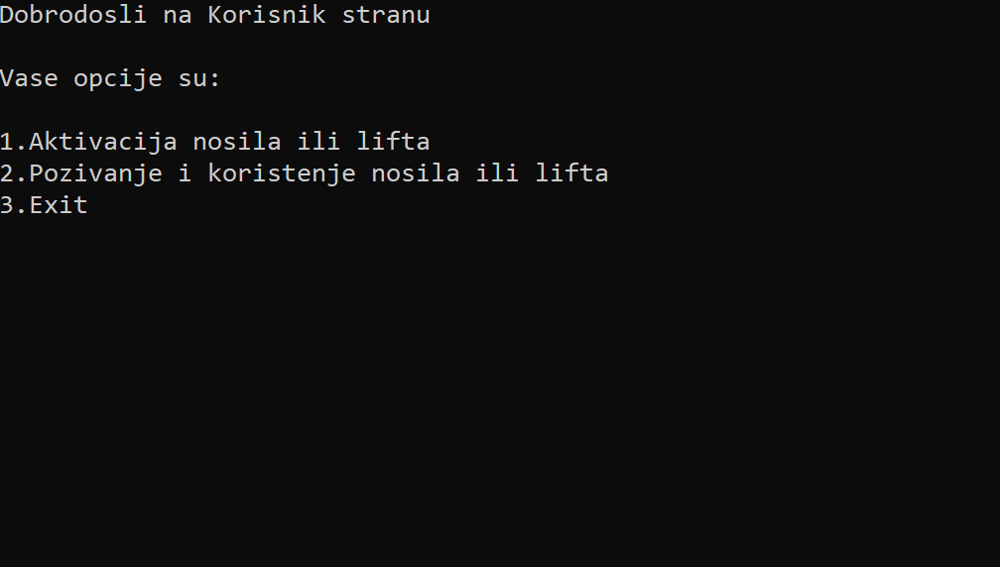
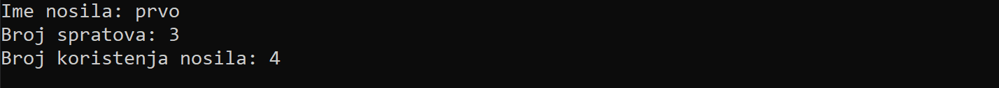
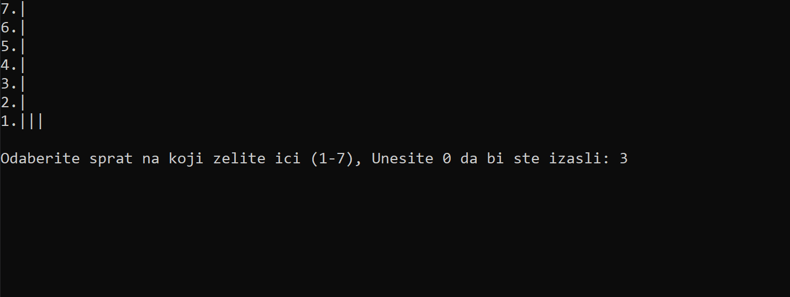
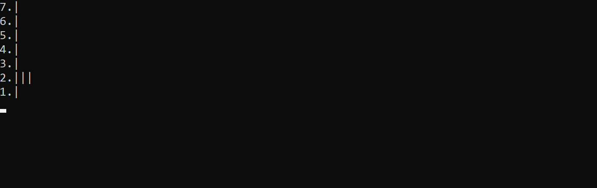
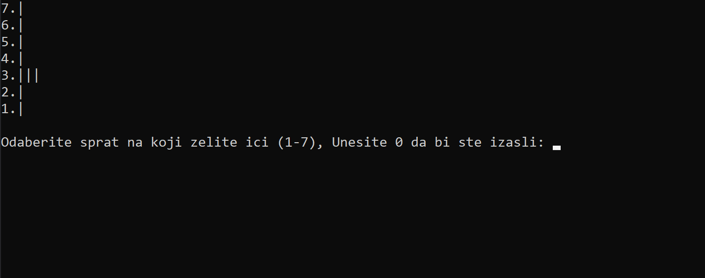

 

  <h1 align="center">Program Lift</h1>

<!-- ABOUT THE PROJECT -->

## O Projektu

Program Lift je jednostavna C aplikacija koja simulira rad lifta. Korisnici mogu interaktirati sa programom kako bi pomjerali lift između spratova i aktivirali ga. Ovaj projekat prikazuje osnovno upravljanje datotekama, unos podataka i jednostavan tok kontrole u C-u.

### Karakteristike

- Autentifikacija korisnika za administratore i redovne korisnike
- Opcije za administratore za kreiranje novih korisnika i kreiranje novog lifta
- Opcije za korisnike za aktivaciju ili pozivanje lifta
- Osnovno rukovanje greškama i validacija unosa

### Izgrađeno Sa

- C Programski Jezik

---

Struktura Programa

Admin Prijava

Admin Strana

Kreiranje Novog Korisnika

Kreiranje Novog Nosila

Korisnička Strana

Aktivacija Nosila ili Lifta

Pozivanje i Korištenje Nosila ili Lifta - Dinamički Prikazano

